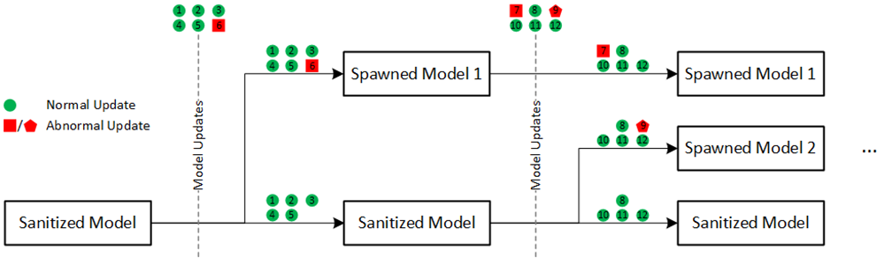
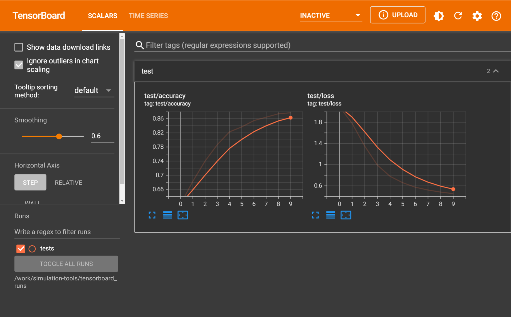

# Federated Learning Simulation Framework (fl-simulation)

A flexible framework for running experiments with PyTorch models in a simulated Federated Learning (FL) environment.

[](https://github.com/microsoft/fl-simulation/actions/workflows/ci.yml)

Currently implemented algorithms:

* Federated Averaging (**FedAvg**): *McMahan, B., Moore, E., Ramage, D., Hampson, S., & Arcas, B. A. (2017). Communication-efficient learning of deep networks from decentralized data. Artificial Intelligence and Statistics, (pp. 1273–1282).*
* **FedProx**: *Li, T., Sahu, A. K., Zaheer, M., Sanjabi, M., Talwalkar, A., & Smith, V. (2018, 12). Federated Optimization in Heterogeneous Networks.*
* Stochastic Controlled Averaging for Federated Learning (**SCAFFOLD**): *Karimireddy, S. P., Kale, S., Mohri, M., Reddi, S. J., Stich, S. U., & Suresh, A. T. (2019, October). SCAFFOLD: Stochastic Controlled Averaging for Federated Learning.*

In addition, we implement the **Branching Algorithm**, our solution, which allows training models using FL in presence of high data heterogeneity or malicious activity by combining BFT with users clusterization in FL. When any of the named disruptions is detected, a new model is spawned to contain that disruptive activity.


_An example of how a model can branch into several models. Green circles represent normal model updates, red squares represent abnormal model updates. Each of the abnormal updates is either being applied to one of the existing models (except for the sanitized) or spawns a new model._

The framework allows adding and using custom algorithms besides the ones named.

The simulation can run with device dropouts and client incentivization/rewards to track how useful a particular user's data was to the training process.

## Examples

First, we need to define the simulation environment. To do so, we define the aggregator and the workers:

```python
from fl_simulation.server.aggregation import FedAvgAggregator
from fl_simulation.client.computation import FedAvgWorker


class MyFedAvgAggregator(FedAvgAggregator):
    pass


class MyFedAvgWorker(FedAvgWorker):
    # the `backprop` method should be overriden in correspondence with the task and data
    def backprop(self, data: Tuple[torch.Tensor, torch.Tensor]) -> torch.Tensor:
        X, y = data

        X, y = X.to(self.device), y.to(self.device)

        pred_scores = self.local_model(X)
        loss = self.loss_fn(pred_scores, y)

        loss.backward()
        return loss

    # if distributed evaluation on each worker is going to take place, we also need the `do_eval_step` method
    # which returns metrics on each batch of evaluation data
    def do_eval_step(self, batch: Tuple[torch.Tensor, torch.Tensor], model: nn.Module) -> Dict[str, float]:
        X, y = batch

        X, y = X.to(self.device), y.to(self.device)
        pred_scores = model(X)
        loss = self.loss_fn(pred_scores, y)

        pred = pred_scores > 0.5

        correct = (pred == y).sum()
        total = pred.numel()

        accuracy = correct / total

        return {"loss": loss, "accuracy": accuracy}
```

Next, we build the simulation itself:
```python
from fl_simulation.simulation import Simulation

num_workers = 3
num_workers_per_round = 2

aggr = MyFedAvgAggregator(model, device)

# each worker has a unique id. In this case, we have 0 1 2 as ids.
workers = {
        i: MyFedAvgWorker(
                model,
                num_epochs=1,
                loss_fn=torch.nn.BCELoss(),
                device=device,
                tensorboard_writer=tb,
                lr=0.01,
        )
        for i in range(num_clients)
}

sim = Simulation(aggr, workers, tensorboard_writer=tb)
```

Finally, we run the simulation. It can be done using the standard loop:
```python
num_users_per_round = 2

results = sim.fit(
        n_rounds=num_rounds,
        n_users_per_round=num_users_per_round,
        # local clients' data for each of the workers.
        train_data={
                0: DataLoader(...),
                1: DataLoader(...),
                2: DataLoader(...)
        },
        # validation data for all of the workers to evaluate local models,
        val_data={
                0: DataLoader(...),
                1: DataLoader(...),
                2: DataLoader(...)
        },
        # or validation data to evaluate the shared model on,
        val_data=DataLoader(...),
        # or both,
        val_data=({
                0: ...,
                1: ...,
                2: ...
        }, DataLoader(...)),
        # save checkpoints every 5 rounds
        checkpoint_freq=5
)
```

`results` contains evaluation results (of the local models, the shared model, or both) for every round.

Alternatively, we may run evaluation in a customized loop:
```python
import random

for r in range(num_rounds):
    selected_workers = random.sample([0,1,2], k=num_users_per_round)
    selected_train_data = {i: train_data[i], for i in selected_workers}

    sim.run_cycle(selected_data)

    # evaluate the shared model
    shared_model = sim.get_shared_model()
    evaluate_shared_model(data, shared_model)
    ...

    # evaluate local models
    for i in selected_workers:
        local_model = sim.get_local_model(i)
        evaluate_local_model(data, local_model)
        ...

    if r % 5 == 0:
        sim.save_checkpoint()
```

Running the `test_fedavg` test, for example, produces the following results:


# Installation
1. Set up and activate a Python environment for Python `>=3.7.1` (recommended: Conda or pyenv).
2. Install this library:
```bash
poetry install
```

# Testing
To run all of the tests, use command:
```bash
pytest
```

To skip slow computation intensive tests run:
```bash
pytest -m "not slow"
```

# Linting
To check for issues:
```bash
yapf --diff --parallel --recursive .
```

To automatically resolve issues:
```bash
yapf --in-place --parallel --recursive .
```

# TensorBoard
You can look at TensorBoard logs by doing:
```bash
tensorboard --logdir tensorboard_runs/
```
or to see a specific folder/file:
```bash
tensorboard --logdir tensorboard_runs/<folder/file>
```
and open the given URL in your browser.
